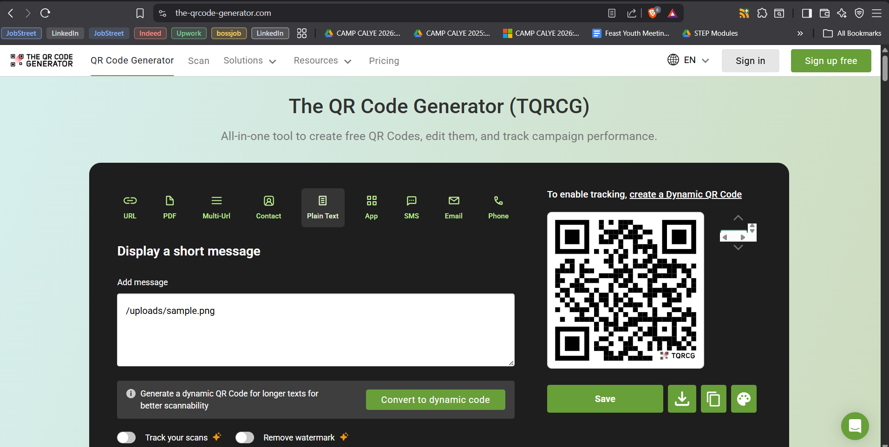
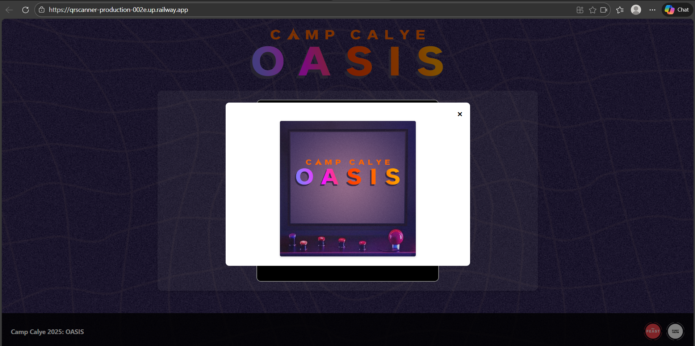

# QRscanner

I created a QR code scanner for the Amazing Race. Each generated QR code provides teams with a hint about the upcoming game, adding an element of fun to the entire Amazing Race.

This app uses a React environment and is deployed using Railway, which already provides HTTPS by default. No additional SSL certificate or web server configuration is required.

# Creating QR Codes

Follow these steps to create QR codes for your images:

## Step 1: Add Image Files
Place your image file inside the `backend\uploads` folder. Supported formats include `.jpg`, `.jpeg`, `.png`, and `.gif`.

## Step 2: Generate QR Code
1. Go to [The QR Code Generator (TQRCG)](https://www.the-qrcode-generator.com/)
2. Select **"Plain Text"** as the QR code type
3. In the "Add message" field, enter the image path using the correct format (see Step 3)



## Step 3: Correct Format
Use the following format for the QR code text:
```
/uploads/filename.png
```

**Examples:**
- `/uploads/sample.png`
- `/uploads/logo.jpg`
- `/uploads/image.png`

**Important:**  
The path must start with `/uploads/` followed by the filename and extension. Do not include the full URL or IP address.

## Step 4: Download and Use
After generating the QR code:
1. Download the QR code image
2. Use it in your materials (posters, flyers, etc.)
3. When scanned, it will display the image from your server

**Sample screenshot from a scanned QR code:**



---

### Notes
Added a "Creating QR Codes" section with:
1. Steps to add image files to `backend\uploads`
2. Instructions to use The QR Code Generator website
3. Screenshot reference showing the interface
4. Correct format specification with examples
5. Sample screenshot of a scanned QR code result

The section is placed right after the introduction so users see it early. The images are referenced using relative paths from the repository root.
